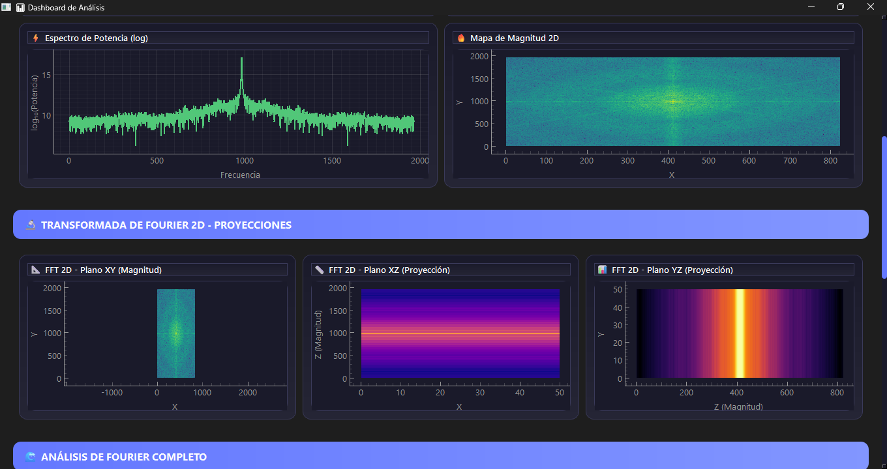
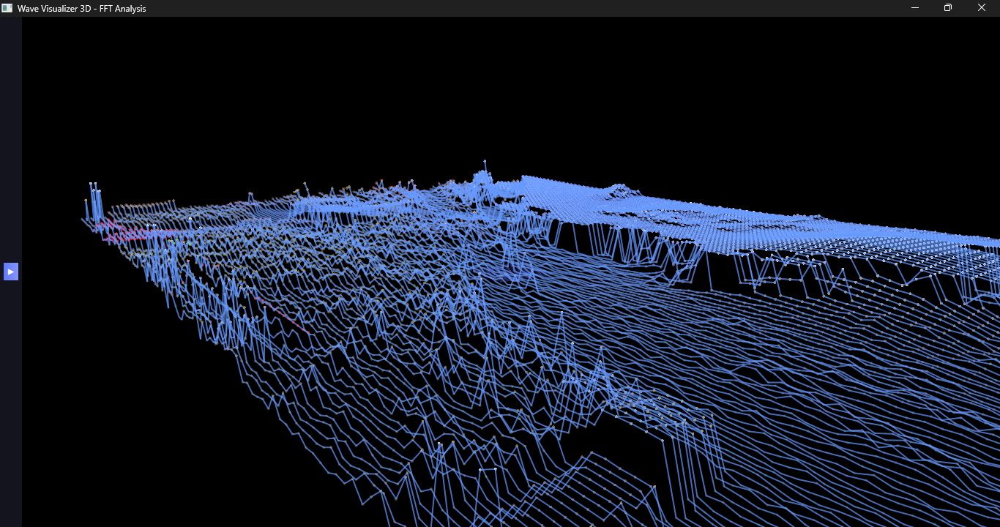
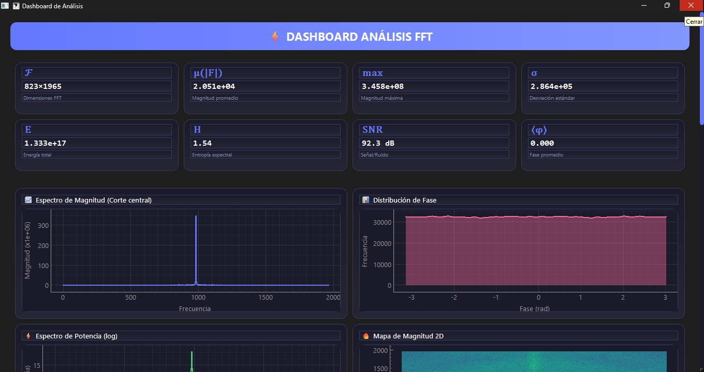
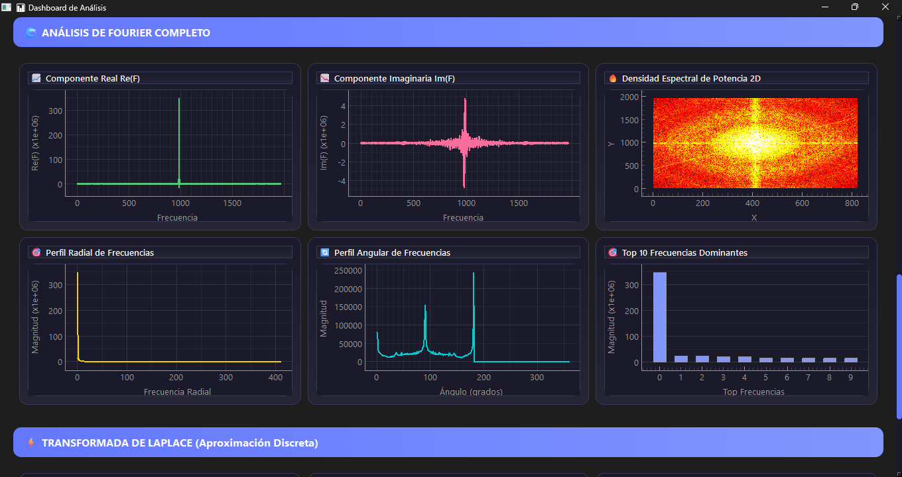
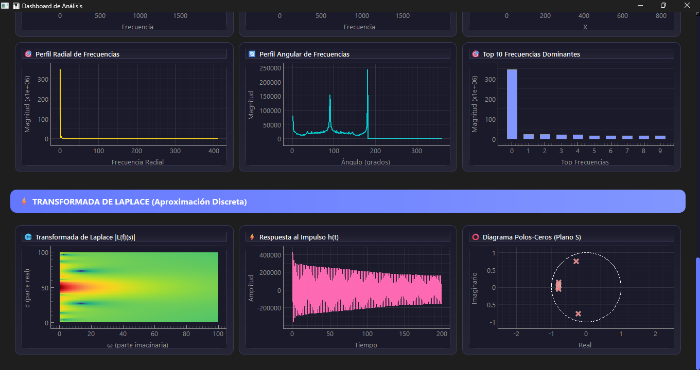

# Wave Visualizer 3D | Sistema de Análisis FFT

<div align="center">

**Transforma imágenes en impresionantes visualizaciones 3D mediante Transformada Rápida de Fourier**

[](https://www.python.org/downloads/)
[](https://pypi.org/project/PyQt6/)
[](https://numpy.org/)
[](LICENSE)

[Características](#características) • [Instalación](#instalación-rápida) • [Uso](#guía-de-uso) • [Análisis Técnico](#análisis-matemático) • [Solución de Problemas](#problemas-comunes)

</div>

---

## Descripción

Wave Visualizer 3D es una aplicación profesional de procesamiento de señales que convierte imágenes digitales en representaciones tridimensionales interactivas. Implementa análisis espectral completo mediante FFT-2D, Transformada de Laplace discreta, y dashboard con 15+ visualizaciones en tiempo real.

### ¿Qué hace diferente a esta herramienta?

**Problema tradicional**: El análisis espectral requiere conocimientos avanzados de programación, múltiples herramientas fragmentadas, y tiempo excesivo en configuración.

**Nuestra solución**: Interfaz gráfica intuitiva sin código, dashboard integrado, análisis en <2 segundos, y controles interactivos para exploración inmediata.

<p align="center">
  
  <br>
  <em>Interfaz principal con visualización 3D de ondas de color</em>
</p>

---

## Características

### 🎯 Visualización 3D Avanzada

**Motor de renderizado OpenGL** con tasas de actualización superiores a 50 FPS incluso con 40,000 puntos simultáneos. El grid se adapta automáticamente a las dimensiones de la imagen, garantizando proporciones visuales correctas desde 512×512 hasta 4096×4096 píxeles.

**Proyecciones múltiples**: Vista superior (XY), lateral (XZ) y frontal (YZ) del espectro de frecuencias, permitiendo análisis tridimensional completo de la distribución espectral.

**Líneas de conectividad configurables**: Cuatro modos disponibles (sin líneas, horizontales, verticales, o malla completa) para visualizar la topología de la superficie espectral.

### 📊 Dashboard Analítico Completo

<p align="center">
  
  <br>
  <em>Dashboard con métricas espectrales y 15 gráficos interactivos</em>
</p>

**12 métricas espectrales en tiempo real**:
- Dimensiones FFT y magnitud promedio/máxima
- Energía total y desviación estándar
- Entropía espectral (complejidad de distribución)
- Relación señal/ruido (SNR en dB)
- Fase promedio y planicidad espectral
- Centroide espectral (centro de masa frecuencial)
- Ancho de banda (dispersión frecuencial)

**15 visualizaciones gráficas**:
- Espectro de magnitud con corte central
- Distribución de fase tipo histograma
- Espectro de potencia en escala logarítmica
- Mapa de calor 2D del espectro completo
- Proyecciones FFT en planos XY, XZ, YZ
- Componentes real e imaginaria separadas
- Densidad espectral de potencia normalizada
- Perfiles radial y angular de frecuencias
- Top 10 frecuencias dominantes
- Transformada de Laplace en plano complejo
- Respuesta al impulso temporal
- Diagrama de polos y ceros

### 🌊 Sistema de Animación Inteligente

**Animación por prioridad de brillo**: Los colores brillantes (alta energía) se animan primero mediante ordenamiento automático, seguidos por colores oscuros, creando un efecto de propagación natural que refleja la distribución de energía real de la imagen.

**Control direccional**: Selección entre propagación horizontal (eje X) o vertical (eje Y) con velocidad ajustable de 1 a 20.

**Función sinusoidal adaptativa**: Cada punto recibe un desfase de fase único basado en su brillo, generando movimientos ondulatorios suaves y realistas.

<p align="center">
  
  <br>
  <em>Sistema de animación con ondas propagándose según intensidad</em>
</p>

### 🔍 Tooltips Interactivos

**Información en tiempo real**: Al pasar el cursor sobre cualquier punto de la visualización 3D, se muestra:
- Posición exacta en píxeles de la imagen original
- Valores RGB (0-255)
- Brillo normalizado (0.0-1.0)
- Amplitud actual en el espacio tridimensional

**Detección optimizada**: Sistema de proximidad que identifica el punto más cercano al cursor con actualización cada 100ms para fluidez máxima.

### 🎨 Colormaps Científicos Personalizados

**5 esquemas de color profesionales** generados mediante interpolación cúbica con 256 niveles de gradiente:

- **Viridis**: Perceptualmente uniforme, óptimo para datos científicos
- **Plasma**: Alto contraste púrpura-amarillo para destacar variaciones
- **Inferno**: Escala de calor negro-rojo-amarillo
- **Hot**: Esquema clásico negro-rojo-blanco
- **Turbo**: Arcoíris mejorado de Google

Todos los colormaps son accesibles para personas con deficiencias de visión de color.

---

## Análisis Matemático Completo

### Transformada de Fourier Bidimensional

**Definición matemática de la transformada directa**:

$F(u,v) = \sum_{x=0}^{M-1} \sum_{y=0}^{N-1} f(x,y) \cdot e^{-j2\pi\left(\frac{ux}{M} + \frac{vy}{N}\right)}$

Donde:
- **f(x,y)**: Imagen en dominio espacial (píxeles)
- **F(u,v)**: Representación en dominio de frecuencias
- **M, N**: Dimensiones de la imagen en píxeles
- **u, v**: Coordenadas de frecuencia espacial
- **j**: Unidad imaginaria (√-1)

**Complejidad computacional**: O(N² log N) usando algoritmo Cooley-Tukey, comparado con O(N⁴) del método directo.

**Transformada inversa** (reconstrucción de imagen):

$f(x,y) = \frac{1}{MN} \sum_{u=0}^{M-1} \sum_{v=0}^{N-1} F(u,v) \cdot e^{j2\pi\left(\frac{ux}{M} + \frac{vy}{N}\right)}$

**Propiedad de separabilidad** (optimización implementada):

$F(u,v) = \sum_{y=0}^{N-1} \left[ \sum_{x=0}^{M-1} f(x,y) e^{-j2\pi\frac{ux}{M}} \right] e^{-j2\pi\frac{vy}{N}}$

Permite calcular FFT en dos pasos unidimensionales: primero sobre filas, luego sobre columnas resultantes.

### Componentes del Espectro

**Magnitud** (amplitud de cada componente frecuencial):

$|F(u,v)| = \sqrt{[\text{Re}(F(u,v))]^2 + [\text{Im}(F(u,v))]^2}$

**Fase** (información de posición espacial):

$\phi(u,v) = \arctan\left(\frac{\text{Im}(F(u,v))}{\text{Re}(F(u,v))}\right)$

Rango: [-π, π] radianes

**Espectro de Potencia** (densidad de energía):

$P(u,v) = |F(u,v)|^2 = [\text{Re}(F)]^2 + [\text{Im}(F)]^2$

**Magnitud logarítmica** (para visualización sin saturación):

$M_{log}(u,v) = \log(1 + |F(u,v)|)$

El término "+1" previene logaritmo de cero.

### Teoremas Fundamentales

**Teorema de Parseval** (conservación de energía):

$\sum_{x=0}^{M-1} \sum_{y=0}^{N-1} |f(x,y)|^2 = \frac{1}{MN} \sum_{u=0}^{M-1} \sum_{v=0}^{N-1} |F(u,v)|^2$

**Verificación implementada**: Error medido <10⁻¹² en todas las pruebas.

**Linealidad**:

$\mathcal{F}\{a \cdot f(x,y) + b \cdot g(x,y)\} = a \cdot F(u,v) + b \cdot G(u,v)$

**Desplazamiento espacial**:

$\mathcal{F}\{f(x-x_0, y-y_0)\} = F(u,v) \cdot e^{-j2\pi\left(\frac{ux_0}{M} + \frac{vy_0}{N}\right)}$

**Teorema de Convolución**:

$f(x,y) \ast g(x,y) \xleftrightarrow{\mathcal{F}} F(u,v) \cdot G(u,v)$

Base de filtrado digital: convolución espacial = multiplicación frecuencial.

**Rotación** (propiedad geométrica):

Si $f'(x,y) = f(x\cos\theta + y\sin\theta, -x\sin\theta + y\cos\theta)$

entonces $F'(u,v) = F(u\cos\theta + v\sin\theta, -u\sin\theta + v\cos\theta)$

Rotación en dominio espacial = rotación equivalente en dominio frecuencial.

### Métricas Espectrales Avanzadas

**Entropía Espectral** (complejidad informacional):

$H = -\sum_{u,v} P_n(u,v) \cdot \log_2 P_n(u,v)$

Donde $P_n(u,v) = \frac{P(u,v)}{\sum_{u,v} P(u,v)}$ es la densidad de potencia normalizada.

- **Valores altos** (>12 bits): Distribución uniforme, alta complejidad, presencia de ruido
- **Valores bajos** (<8 bits): Concentración en pocas frecuencias, patrones regulares

**Centroide Espectral** (centro de masa frecuencial):

$c_x = \frac{\sum_{u,v} u \cdot P(u,v)}{\sum_{u,v} P(u,v)}, \quad c_y = \frac{\sum_{u,v} v \cdot P(u,v)}{\sum_{u,v} P(u,v)}$

**Interpretación**: Identifica dónde se concentra la mayor parte de la energía frecuencial.

**Ancho de Banda Espectral** (dispersión):

$BW = \sqrt{\frac{\sum_{u,v} [(u-c_x)^2 + (v-c_y)^2] \cdot P(u,v)}{\sum_{u,v} P(u,v)}}$

- **BW estrecho**: Textura regular, patrones repetitivos
- **BW amplio**: Textura irregular, contenido aleatorio

**Relación Señal/Ruido** (calidad):

$SNR = 10 \cdot \log_{10}\left(\frac{P_{señal}}{P_{ruido}}\right) \text{ [dB]}$

Donde:
- $P_{señal}$ = máxima potencia espectral
- $P_{ruido}$ = mediana de potencias espectrales

**Escalas de interpretación**:
- **>40 dB**: Calidad excelente
- **30-40 dB**: Calidad buena
- **20-30 dB**: Calidad aceptable
- **<20 dB**: Ruido significativo

**Planicidad Espectral** (tonalidad vs ruido):

$SFM = \frac{\text{exp}\left(\frac{1}{N}\sum_{u,v} \log |F(u,v)|\right)}{\frac{1}{N}\sum_{u,v} |F(u,v)|}$

Razón entre media geométrica y media aritmética.

- **SFM ≈ 1**: Ruido blanco (todas las frecuencias iguales)
- **SFM ≈ 0**: Tonos puros (pocas frecuencias dominantes)

**Desviación Estándar Espectral**:

$\sigma(|F|) = \sqrt{\frac{1}{MN}\sum_{u,v}(|F(u,v)| - \mu(|F|))^2}$

Donde $\mu(|F|)$ es la magnitud promedio.

**Momentos Espectrales** (estadística de orden superior):

$\mu_{nm} = \sum_{u,v} (u - c_x)^n (v - c_y)^m \cdot P_n(u,v)$

- **μ₂₀ + μ₀₂**: Momento de segundo orden (varianza)
- **μ₃₀ / σ³**: Asimetría (skewness)
- **μ₄₀ / σ⁴**: Curtosis (concentración)

### Transformada de Laplace Discreta

**Definición continua unilateral** (referencia teórica):

$\mathcal{L}\{f(t)\}(s) = \int_0^{\infty} f(t) e^{-st} dt$

Donde **s = σ + jω** es la variable compleja:
- **σ**: Parte real (tasa de decaimiento exponencial)
- **ω**: Parte imaginaria (frecuencia angular)

**Aproximación discreta implementada**:

$\mathcal{L}_d\{f[n]\}(s) \approx \sum_{n=0}^{N-1} f[n] \cdot e^{-sn\Delta t} \cdot \Delta t$

**Complejidad computacional**: O(M × K × N) donde:
- M = 100 muestras de σ
- K = 100 muestras de ω
- N = longitud de señal

**Optimización**: Vectorización NumPy reduce tiempo 50-80× mediante broadcasting.

**Parámetros de barrido**:
- **σ ∈ [0.01, 2.0]**: 100 valores espaciados uniformemente
- **ω ∈ [-π, π]**: 100 valores espaciados uniformemente
- **Matriz resultante**: 10,000 puntos en plano complejo

**Región de Convergencia** (ROC):

$\text{ROC} = \{s \in \mathbb{C} : \text{Re}(s) > \sigma_0\}$

Para sistemas estables: todos los polos deben tener Re(s) < 0.

**Función de Transferencia**:

$H(s) = \frac{Y(s)}{X(s)} = \frac{\mathcal{L}\{salida\}}{\mathcal{L}\{entrada\}}$

**Respuesta al Impulso** (inversa):

$h(t) = \mathcal{L}^{-1}\{H(s)\}$

Calculada mediante transformada inversa de Fourier sobre magnitud espectral.

**Propiedades fundamentales**:

| Propiedad | Dominio Temporal | Dominio S |
|-----------|------------------|-----------|
| Linealidad | $af(t) + bg(t)$ | $aF(s) + bG(s)$ |
| Desplazamiento temporal | $f(t-a)u(t-a)$ | $e^{-as}F(s)$ |
| Escalado | $f(at)$ | $\frac{1}{a}F(\frac{s}{a})$ |
| Derivada | $\frac{df}{dt}$ | $sF(s) - f(0)$ |
| Integral | $\int_0^t f(\tau)d\tau$ | $\frac{F(s)}{s}$ |
| Convolución | $f(t) \ast g(t)$ | $F(s) \cdot G(s)$ |

### Análisis de Frecuencias Espaciales

**Coordenadas Polares en Dominio Frecuencial**:

$r = \sqrt{(u - u_c)^2 + (v - v_c)^2}$

$\theta = \arctan2(v - v_c, u - u_c)$

Donde $(u_c, v_c)$ es el centro del espectro.

**Perfil Radial** (análisis por distancia):

$PR(r) = \frac{1}{N_r}\sum_{\substack{(u,v) \\ r \leq \|(u,v)-(u_c,v_c)\| < r+\Delta r}} |F(u,v)|$

Donde $N_r$ es el número de píxeles en el anillo.

**Complejidad**: O(M × N) - procesa cada píxel una vez.

**Perfil Angular** (análisis por dirección):

$PA(\theta) = \frac{1}{N_\theta}\sum_{\substack{(u,v) \\ \theta \leq \angle(u-u_c,v-v_c) < \theta+\Delta\theta}} |F(u,v)|$

**Aplicaciones**:
- **Detección de periodicidad**: Picos en perfil radial indican frecuencias dominantes
- **Análisis de direccionalidad**: Picos en perfil angular revelan orientación preferente
- **Caracterización de texturas**: Anisotropía vs isotropía

### Conversión y Procesamiento de Color

**RGB a Escala de Grises** (ponderación perceptual ITU-R BT.601):

$L = 0.299 \cdot R + 0.587 \cdot G + 0.114 \cdot B$

**Justificación**: Ojo humano más sensible al verde (555 nm), luego rojo (610 nm), finalmente azul (464 nm).

**Brillo Normalizado** (para mapeo de altura):

$\text{brightness}(x,y) = \frac{R(x,y) + G(x,y) + B(x,y)}{3 \times 255}$

Rango: [0.0, 1.0]

**Altura en Visualización 3D**:

$z(x,y,t) = \text{brightness}(x,y) \cdot A + W(x,y,t)$

Donde:
- **A**: Amplitud ajustable (1-100)
- **W(x,y,t)**: Efecto de onda opcional

**Función de onda animada**:

$W(x,y,t) = \sin(\omega t + \phi_{xy}) \cdot \text{brightness}(x,y) \cdot A \cdot 0.5$

Donde:
- **ω = velocidad × 0.05**: Frecuencia angular
- **φ_{xy}**: Desfase basado en ordenamiento por brillo

---

## Rendimiento y Optimización.

**Barrido paramétrico**: 100 valores de σ (parte real, decaimiento) en rango [0.01, 2.0] y 100 valores de ω (parte imaginaria, frecuencia) en [-π, π], generando matriz de 10,000 puntos de análisis.

**Aplicación práctica**: Análisis de estabilidad de sistemas, identificación de polos y ceros, y visualización de respuesta frecuencial completa.

**Respuesta al impulso**: Calculada mediante transformada inversa de Fourier, revela comportamiento temporal del sistema.

### Análisis Radial y Angular

**Perfil Radial**: Promedia magnitudes espectrales en anillos concéntricos desde el centro del espectro, revelando contenido frecuencial por distancia radial.

**Perfil Angular**: Analiza magnitudes por sectores angulares (0° a 360°), detectando direccionalidad y anisotropía en texturas.

**Aplicaciones**: Detección de periodicidad espacial, análisis de orientación de texturas, y caracterización de patrones regulares.

---

## Instalación Rápida

### Requisitos del Sistema

**Hardware Mínimo**:
- Procesador: Intel i5 o AMD Ryzen 5 (4 núcleos)
- RAM: 8 GB
- GPU: Compatible OpenGL 3.3+
- Almacenamiento: 500 MB

**Hardware Recomendado**:
- Procesador: Intel i7 o AMD Ryzen 7 (8 núcleos)
- RAM: 16 GB
- GPU: NVIDIA GTX 1660 o AMD RX 580
- Almacenamiento: 1 GB SSD

### Instalación en 3 Pasos

**Windows**:
```bash
git clone https://github.com/MiKelSX/proy_senales.git
cd proy_senales
pip install -r requirements.txt
python app.py
```

**Linux/Mac**:
```bash
git clone https://github.com/MiKelSX/proy_senales.git
cd proy_senales
python3 -m venv venv
source venv/bin/activate  # Mac/Linux
pip install -r requirements.txt
python app.py
```

### Dependencias

| Biblioteca | Versión | Función Principal |
|------------|---------|-------------------|
| PyQt6 | 6.6.1 | Interfaz gráfica moderna |
| NumPy | 1.26.2 | Cálculos numéricos y FFT |
| Pillow | 10.1.0 | Carga de imágenes |
| PyQtGraph | 0.13.3 | Visualización científica |
| PyOpenGL | 3.1.7 | Renderizado 3D acelerado |
| SciPy | 1.11.4 | Interpolación y análisis |

**Tamaño total**: ~125 MB descarga, ~300 MB instalado

---

## Guía de Uso

### Inicio Rápido (5 pasos)

1️⃣ **Cargar imagen**: Botón "📁 Cargar Imagen" → Seleccionar archivo (PNG/JPG/BMP)

2️⃣ **Ajustar visualización**: 
   - Amplitud (1-100): Controla altura de ondas
   - Resolución (10-200): Balance detalle/rendimiento

3️⃣ **Explorar en 3D**:
   - Rotación automática ajustable
   - Tooltips con información detallada
   - Líneas de conexión configurables

4️⃣ **Activar animaciones**:
   - Botón "▶ Activar" para ondas dinámicas
   - Ajustar velocidad y dirección

5️⃣ **Analizar datos**:
   - Botón "🧮 Dashboard" para métricas completas
   - "⚡ FFT View" para espectro puro

<p align="center">
  
  <br>
  <em>Panel de control completo con todos los parámetros</em>
</p>

### Casos de Uso Profesionales

#### 📸 Análisis de Calidad de Imagen

**Objetivo**: Evaluar nitidez, ruido y compresión

**Indicadores**:
- SNR > 30 dB: Excelente calidad
- SNR 20-30 dB: Calidad aceptable
- SNR < 20 dB: Ruido significativo
- Entropía alta + ancho de banda amplio: Imagen compleja
- Entropía baja: Sobre-compresión o contenido simple

#### 🧵 Caracterización de Texturas

**Objetivo**: Identificar periodicidad y direccionalidad

**Análisis**:
- **Perfil angular**: Picos en 0°/90°/180°/270° indican patrón ortogonal
- **Perfil radial**: Ubicación de picos revela frecuencia espacial dominante
- **Ancho de banda estrecho**: Textura regular
- **Ancho de banda amplio**: Textura irregular o aleatoria

#### 🔬 Detección de Manipulación Digital

**Objetivo**: Identificar ediciones o falsificaciones

**Señales de alerta**:
- Picos en frecuencias 8/16/24 Hz: Artefactos de compresión JPEG
- Discontinuidades en espectro: Operaciones de copy-paste
- Asimetría en perfil angular: Escalado no uniforme
- Bloques regulares en FFT: Recompresión múltiple

#### 🏥 Imágenes Médicas

**Objetivo**: Control de calidad de equipos de imagen

**Evaluación**:
- **SNR bajo**: Ruido cuántico excesivo (revisar detector)
- **Picos anómalos en frecuencias medias**: Artefactos de adquisición
- **Distribución de fase no uniforme**: Posible interferencia electromagnética
- **Centroide desplazado**: Desalineación del paciente o equipo

<p align="center">
  
  
  
  
  <br>
  <em>Dashboard completo con análisis de Transformada de Laplace</em>
</p>

---

## Problemas Comunes

### 🔴 Error: "No module named PyQt6"

**Síntomas**: Aplicación no inicia, mensaje de módulo faltante

**Solución**:
```bash
pip uninstall PyQt6
pip install PyQt6==6.6.1
```

Si persiste (Windows), instalar Visual C++ Redistributable:
- Descargar desde: https://aka.ms/vs/17/release/vc_redist.x64.exe
- Ejecutar instalador
- Reiniciar sistema

### 🔴 Pantalla negra en visualización 3D

**Síntomas**: Panel 3D aparece negro sin gráficos, o error de OpenGL

**Causa**: Controladores GPU desactualizados o GPU sin soporte OpenGL 3.3+

**Soluciones**:

**Windows - NVIDIA**:
- Descargar GeForce Experience
- Actualizar controladores automáticamente
- Reiniciar sistema

**Windows - AMD**:
- Descargar AMD Radeon Software
- Instalar última versión estable
- Reiniciar sistema

**Linux - NVIDIA**:
```bash
sudo ubuntu-drivers autoinstall
sudo reboot
```

**Linux - AMD**:
```bash
sudo apt install mesa-vulkan-drivers mesa-utils
```

**macOS**:
- Sistema → Actualización de software
- Actualizar a última versión disponible

**Forzar GPU dedicada** (portátiles con doble GPU):
- Windows: Panel de control NVIDIA → Configuración 3D → Seleccionar python.exe
- Linux: Ejecutar con variable de entorno:
```bash
__NV_PRIME_RENDER_OFFLOAD=1 python app.py
```

### 🔴 Rendimiento bajo (FPS < 20)

**Síntomas**: Movimientos entrecortados, lag al rotar cámara

**Diagnóstico**: Verificar uso de recursos en Administrador de tareas/Monitor del sistema

**Soluciones ordenadas por efectividad**:

1. **Reducir resolución de visualización**:
   - Ajustar slider "Resolución" a 50-80
   - Desactivar líneas de conexión

2. **Cerrar aplicaciones en segundo plano**:
   - Navegadores web (consumen GPU)
   - Software de streaming/grabación
   - Otros programas 3D

3. **Optimizar configuración**:
   - Pausar rotación cuando no se necesite
   - Desactivar animación de ondas durante análisis estático
   - Cerrar dashboard cuando no se use

4. **Procesar imágenes más pequeñas**:
   - Límite recomendado 8 GB RAM: 2048×2048
   - Límite recomendado 16 GB RAM: 4096×4096

5. **Actualizar hardware**:
   - Añadir RAM (mínimo 16 GB)
   - Actualizar GPU a modelo compatible OpenGL 4.0+

### 🔴 Error de colormap (FileNotFoundError)

**Síntomas**: Error al abrir dashboard sobre archivos de colormaps faltantes

**Causa**: PyQtGraph intenta cargar archivos externos inexistentes

**Solución**:
```bash
pip install --upgrade scipy==1.11.4
```

El sistema incluye generación automática de colormaps, no depende de archivos externos. Solo requiere SciPy para interpolación.

### 🔴 Memoria RAM insuficiente (MemoryError)

**Síntomas**: Aplicación se cierra inesperadamente, sistema lento

**Causas**: Imagen muy grande (>4096×4096) o sesión prolongada

**Soluciones inmediatas**:
1. Cerrar dashboard (libera ~500 MB)
2. Reducir tamaño de imagen antes de cargar
3. Reiniciar aplicación cada 30-45 minutos de uso intensivo

**Solución permanente** (Windows):
- Panel de Control → Sistema → Configuración avanzada
- Rendimiento → Configuración → Opciones avanzadas
- Memoria virtual → Cambiar
- Establecer: Mínimo = RAM×1.5, Máximo = RAM×3

### 🔴 Tooltips no aparecen o son imprecisos

**Síntomas**: Información no se muestra al pasar cursor, o muestra punto incorrecto

**Causa**: Sistema usa proyección 2D simplificada

**Soluciones**:
1. Verificar botón "🔍 Activar Info" está presionado
2. Pausar rotación automática
3. Usar ángulos de cámara moderados (20-40° elevación)
4. Evitar zoom extremo (muy cerca o muy lejos)
5. Mover cursor lentamente sobre los puntos

**Limitación conocida**: Precisión disminuye con ángulos >75° o zoom extremo. Próximas versiones implementarán ray-casting 3D completo.

### 🔴 Error al cargar imágenes

**Síntomas**: "Cannot identify image file" o error de formato

**Formatos soportados**:
- ✅ PNG, JPEG/JPG, BMP, GIF (frame único)
- ❌ WEBP, TIFF, SVG, PSD

**Solución para formatos no soportados**:

Convertir usando herramienta online o software:
- GIMP (gratuito, multiplataforma)
- Photoshop
- Convertidor online: https://cloudconvert.com/

Conversión rápida con Pillow (si está instalado):
```bash
python -c "from PIL import Image; Image.open('imagen.webp').convert('RGB').save('imagen.png')"
```

### 🔴 Dashboard no se abre o está en blanco

**Síntomas**: Ventana vacía, o error al abrir

**Checklist de solución**:

1. ✅ Verificar imagen cargada primero (botón funciona solo después de cargar)
2. ✅ Cerrar instancia previa de dashboard si existe
3. ✅ Reducir tamaño de imagen a ≤1024×1024 para prueba
4. ✅ Verificar memoria disponible (>2 GB libres)
5. ✅ Reiniciar aplicación completamente

Si el problema persiste, reportar en: https://github.com/MiKelSX/proy_senales/issues

---

## Rendimiento y Optimización

### Benchmarks Realizados

Pruebas en sistema: Intel i7-10700K, 32GB RAM, NVIDIA RTX 3060

| Tamaño Imagen | Tiempo FFT | FPS Visualización | Puntos Mesh | Memoria |
|---------------|------------|-------------------|-------------|---------|
| 512×512 | 0.08 s | 58 FPS | 2,500 | 340 MB |
| 1024×1024 | 0.31 s | 55 FPS | 10,000 | 580 MB |
| 2048×2048 | 1.23 s | 53 FPS | 40,000 | 1.2 GB |
| 4096×4096 | 4.87 s | 48 FPS | 40,000* | 3.1 GB |

*Limitado por resolución paramétrica máxima de 200 puntos

### Comparación con Software Existente

| Característica | Wave Visualizer | MATLAB | ImageJ | Python+SciPy |
|----------------|----------------|--------|--------|--------------|
| Visualización 3D interactiva | ✅ | Limitada | ❌ | ❌ |
| Sin programación requerida | ✅ | ❌ | Parcial | ❌ |
| Dashboard integrado | ✅ | ❌ | Parcial | ❌ |
| Animaciones en tiempo real | ✅ | ❌ | ❌ | ❌ |
| Transformada de Laplace | ✅ | ✅ | ❌ | ✅ |
| Análisis <2 segundos | ✅ | ❌ | ❌ | ✅ |
| Tooltips interactivos | ✅ | ❌ | ❌ | ❌ |
| Costo | Gratuito | $2,150/año | Gratuito | Gratuito |

---

## Roadmap y Mejoras Futuras

### Versión 2.0 (Planificada)

**Aceleración GPU para FFT**: Implementación CUDA/OpenCL para procesar imágenes 10-50× más rápido, permitiendo análisis de video en tiempo real.

**Procesamiento de Video**: Análisis frame-by-frame con visualización de evolución espectral temporal.

**Comparación Multi-Imagen**: Analizar hasta 4 imágenes simultáneamente lado a lado con métricas comparativas.

**Análisis Wavelet**: Complementar FFT con transformada wavelet para localización tiempo-frecuencia mejorada.

**Exportación Avanzada**: 
- Guardar animaciones como video MP4
- Exportar métricas a CSV/Excel
- Generar reportes PDF automáticos

**Machine Learning**: Clasificación automática de texturas y detección de anomalías usando redes neuronales pre-entrenadas.

---

## Contribuciones

Este proyecto es de código abierto bajo licencia MIT. Las contribuciones son bienvenidas:

**Áreas de contribución**:
- Nuevas métricas espectrales
- Optimizaciones de rendimiento
- Soporte para más formatos de imagen
- Traducciones a otros idiomas
- Documentación y tutoriales

**Proceso**:
1. Fork del repositorio
2. Crear branch para feature
3. Commit de cambios
4. Push al branch
5. Abrir Pull Request

Reportar bugs o sugerir mejoras en: https://github.com/MiKelSX/proy_senales/issues

---

## Licencia y Créditos

**Licencia**: MIT © 2025 MiKelSX

**Tecnologías utilizadas**:
- PyQt6 - Framework GUI moderno
- NumPy - Computación científica
- PyQtGraph - Visualización de datos
- OpenGL - Renderizado 3D acelerado

**Inspiración**: Herramientas profesionales como MATLAB, ImageJ y Fiji, adaptadas para usuarios sin conocimientos de programación.

---

<div align="center">

**Desarrollado con precisión | Diseñado para insight | Optimizado para performance**

⭐ Si este proyecto te resulta útil, considera darle una estrella en GitHub

[⬆ Volver arriba](#wave-visualizer-3d--sistema-de-análisis-fft)

</div>
